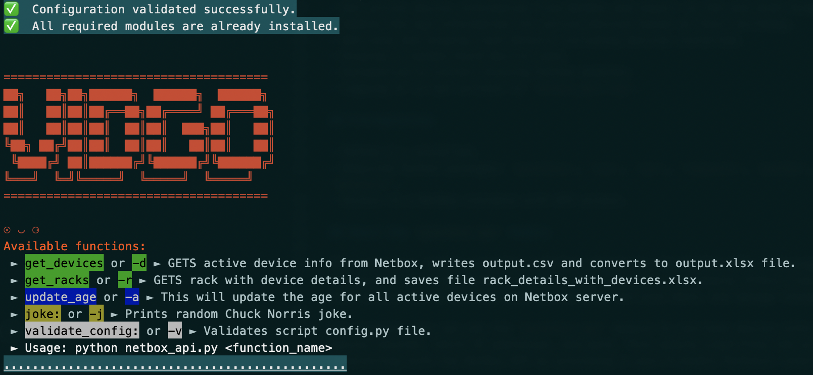

# NetBox Automation Script with Logging

This script automates data retrieval from the NetBox API and offers various functionalities for data processing. It also includes a logging mechanism to provide better visibility into the script's operation and potential issues.

## Overview

The NetBox Automation Script interacts with the NetBox API to retrieve device information, calculate device age, update age data in NetBox, and display Chuck Norris jokes. The script offers multiple features and functionalities to assist in managing and analyzing network device data.

## Logging

The script includes a logging mechanism to keep track of various events and errors during its execution. Here's how the logging works:

- The built-in Python `logging` module is used to create and manage log messages.
- Log messages are written to a file named `netbox_api.log`.
- Different log levels (INFO, WARNING, ERROR) categorize the importance of each message.
- Log messages from different functions and parts of the script are recorded, aiding in identifying script behavior and issues.
- By default, log messages are printed to the terminal and stored in the log file. You can control the visibility of log messages in the terminal by adjusting the log level.

For more details on how logging works and how you can customize its behavior, refer to the comments within the script's code and the [Python Logging documentation](https://docs.python.org/3/library/logging.html).

## Features

- Connects to the NetBox API to retrieve and process device information.
- Calculates the age of devices based on birthdate information.
- Updates the age information for active devices in NetBox.
- Displays random Chuck Norris jokes for entertainment.

## Prerequisites

- Python 3.x installed.
- Required Python packages: `pynetbox`, `csv`, `sys`, `requests`, `pandas`, `datetime`, `openpyxl`.
- Access to a NetBox instance with API access.

## About the `pynetbox.api` Module

The `pynetbox` module provides a Python client for the NetBox API, allowing seamless interaction with the NetBox instance. The `pynetbox.api` module offers classes and methods that enable you to perform CRUD operations, retrieve data, and manage resources in NetBox.

For example, you can use the `pynetbox.api` module to retrieve device information, update device records, fetch IP addresses, and more. This module simplifies the process of interacting with the NetBox API by providing a user-friendly Pythonic interface.

For more information on using the `pynetbox` module, refer to the official documentation: [pynetbox Documentation](https://pynetbox.readthedocs.io/en/latest/).

## Getting Started

1. Clone this repository to your local machine.
2. Install the required dependencies using:
3. Create a `config.py` file and provide your NetBox API token and URL as `NETBOX_TOKEN` and `NETBOX_URL` respectively.
4. Run the script using: `python netbox_api.py <function_name>`.

## Available Functions

- `get_devices` (`-d`): Retrieves active device information from NetBox, writes to `output.csv`, and converts it to an `output.xlsx` file.
- `update_age` (`-a`): Updates the age of active devices in NetBox based on birthdate information.
- `joke` (`-j`): Displays a random Chuck Norris joke.

## Device Fields Fetched from get_devices

The script retrieves the following device fields from the NetBox server:

- `Name`: Name of the device.
- `Status`: Status of the device (Active or other).
- `Site`: Location site of the device.
- `Rack`: Rack information of the device.
- `Role`: Role of the device (e.g., switch, router).
- `Manufacturer`: Manufacturer of the device.
- `Type`: Type of the device.
- `Owner`: Owner of the device.
- `Birthday`: Birthdate of the device (custom field).
- `Age (Months)`: Calculated age of the device in months.
- `Service Contract`: Service contract information (custom field).
- `Warranty`: Warranty information (custom field).
- `Serial Number`: Serial number of the device.
- `Platform`: Platform of the device.
- `Software`: Software information (custom field).
- `SW_Version`: Software version (custom field).
- `Primary IP`: Primary IP address of the device.

## Usage

Run the script with a specified function name to perform the desired action. For example:
- To retrieve device information and generate CSV and Excel reports: `python netbox_api.py get_devices`
- To update age information for active devices: `python netbox_api.py update_age`
- To display a Chuck Norris joke: `python netbox_api.py joke`

## Terminal Grab

